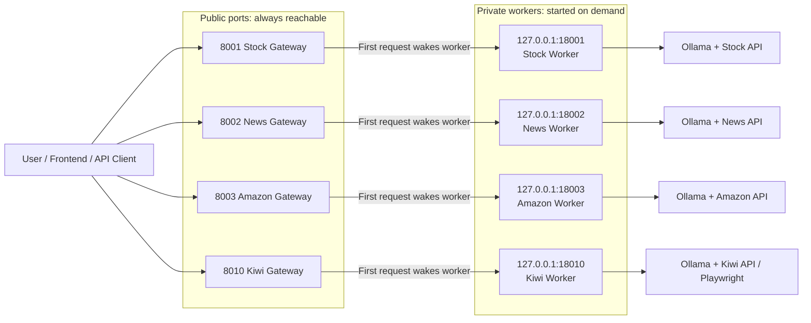
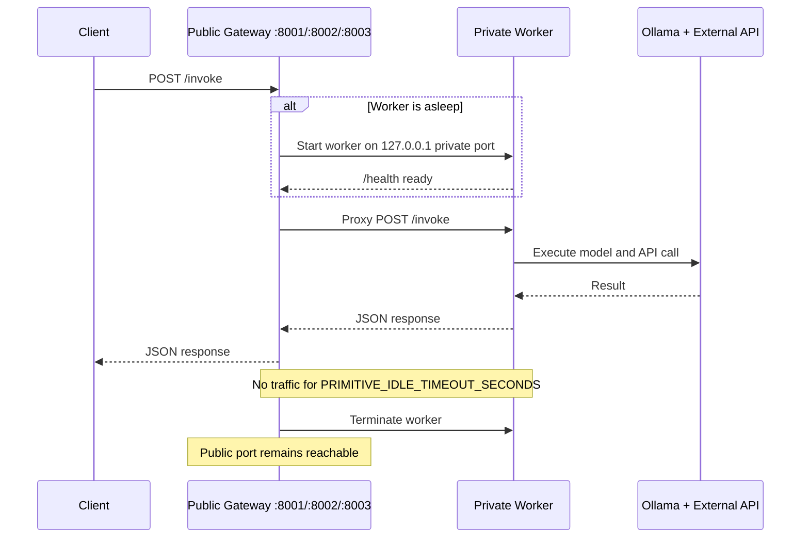
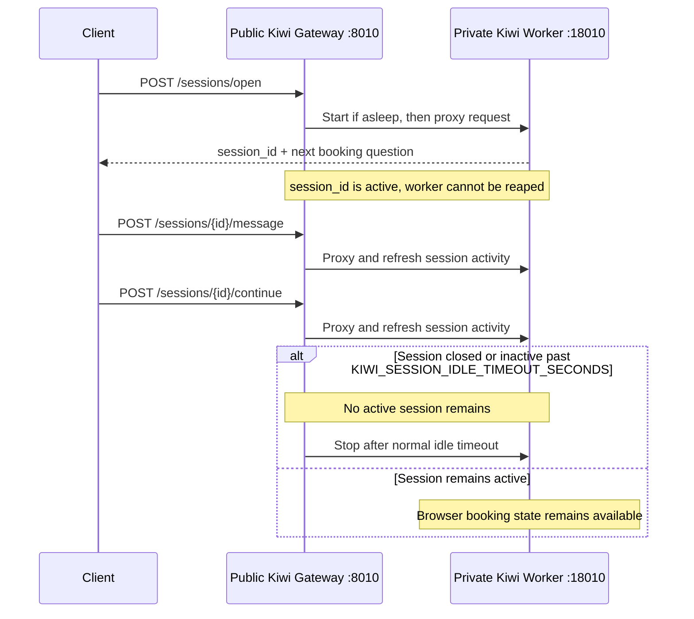
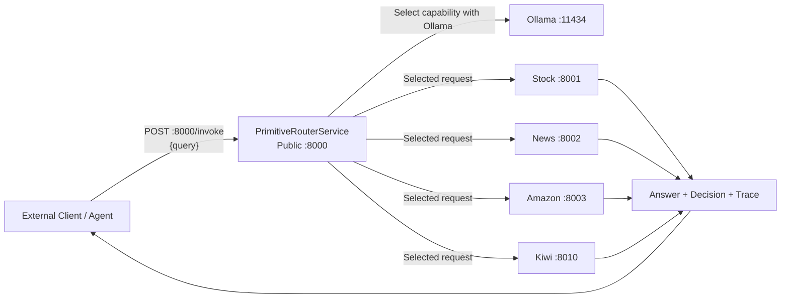

# LLM Tool Primitives without Router

This demo exposes each Tool Primitive through an independent public HTTP endpoint.
There is no central tool router. The client directly calls the desired primitive endpoint.

The default startup scripts use an on-demand gateway on every public port. A lightweight
gateway is always listening so the endpoint remains reachable, while the model-backed
worker binds only to `127.0.0.1` on a private port and starts on its first business request.

Each primitive uses Qwen3:8B to understand the user query, extract API arguments, call the external API, and return a structured result.

## On-Demand Flow

The public ports do not go offline. Each public port is owned by a lightweight gateway,
which wakes the corresponding private worker only when an API request needs it.



### Stateless Primitive Lifecycle

`stock`, `news`, and `amazon` use this lifecycle:



### Kiwi Booking Lifecycle

Kiwi must keep its worker alive during an active guided booking session because the
Playwright browser state and session data live inside that worker process.



Operationally:

1. Clients continue calling the public ports exactly as before.
2. `GET /health` checks the lightweight gateway and reports `worker_running` without waking the worker.
3. `/invoke`, `/docs`, `/openapi.json`, and Kiwi session routes wake the relevant private worker if needed.
4. When a stateless worker is idle for `PRIMITIVE_IDLE_TIMEOUT_SECONDS`, the gateway shuts it down.
5. Kiwi is only eligible for idle shutdown after all active booking sessions have closed or expired.

## Unified Router API

The standalone Router service exposes the chat selection flow as a public API without
requiring the Next.js demo frontend. It listens on public port `8000` and calls the
existing primitive gateways through localhost.



Router endpoints:

| Method | Endpoint | Purpose |
|---|---|---|
| `GET` | `/health` | Confirm the Router API is online |
| `GET` | `/metadata` | List its available primitive capabilities |
| `POST` | `/invoke` | Send one message and automatically select/invoke a primitive |

Example:

```bash
curl -X POST http://localhost:8000/invoke \
  -H "Content-Type: application/json" \
  -d '{"query":"What is AAPL stock price?"}'
```

The response includes the final `answer`, the router `decision`, the selected primitive,
the primitive result, and the execution `trace`. If no primitive is required, the Router
uses the shared Ollama model to answer the message directly instead of returning a
placeholder or inventing a primitive result.

## Services

| Primitive | Public gateway port | Private worker port | Endpoint | Example |
|---|---:|---:|---|---|
| PrimitiveRouterService | 8000 | N/A | POST `/invoke` | `What is AAPL stock price?` |
| StockPrimitiveModel | 8001 | 18001 | POST `/invoke` | `What is AAPL stock price?` |
| NewsPrimitiveModel | 8002 | 18002 | POST `/invoke` | `latest news about climate change` |
| AmazonPrimitiveModel | 8003 | 18003 | POST `/invoke` | `Search Amazon wireless earbuds` |
| KiwiBookingPrimitiveModel | 8010 | 18010 | POST `/invoke`, `/sessions/*` | `Find a one-way flight from SEA to JFK on 2026-06-12` |

## Setup

```bash
pip install -r requirements.txt
cp .env.example .env
ollama pull qwen3:8b
playwright install chromium
```

Start Ollama in another terminal if it is not already running:

```bash
ollama serve
```

Run all primitive services:

```bash
./run_all.sh
```

The public endpoints remain the same:

```text
Public gateway 8001 -> private stock worker 18001, started on demand
Public gateway 8002 -> private news worker 18002, started on demand
Public gateway 8003 -> private amazon worker 18003, started on demand
Public gateway 8010 -> private kiwi worker 18010, started on demand
```

The unified router is available at:

```text
Public router 8000 -> selects and invokes one public primitive gateway locally
```

`stock`, `news`, and `amazon` workers stop after `PRIMITIVE_IDLE_TIMEOUT_SECONDS`
without traffic. Kiwi stops only after it has no active booking sessions and the worker
has been idle for that duration. An active Kiwi session expires after
`KIWI_SESSION_IDLE_TIMEOUT_SECONDS` without a session message or continue request.
An expired session cannot be resumed because its browser state was held by the stopped
worker process.

`GET /health` is served by the gateway without starting a worker. It reports
`worker_running` so deployments can confirm whether the private worker is asleep.
Accessing `/docs`, `/openapi.json`, or a business endpoint starts the worker and
proxies to its original API surface.

To run all services in their previous always-running mode for development:

```bash
./run_direct_all.sh
```

## Test

```bash
curl -X POST http://localhost:8000/invoke \
  -H "Content-Type: application/json" \
  -d '{"query":"What is AAPL stock price?"}'

curl -X POST http://localhost:8001/invoke \
  -H "Content-Type: application/json" \
  -d '{"query":"What is AAPL stock price?"}'

curl -X POST http://localhost:8002/invoke \
  -H "Content-Type: application/json" \
  -d '{"query":"latest news about climate change"}'

curl -X POST http://localhost:8003/invoke \
  -H "Content-Type: application/json" \
  -d '{"query":"Search Amazon wireless earbuds"}'

curl -X POST http://localhost:8010/invoke \
  -H "Content-Type: application/json" \
  -d '{"query":"Find a one-way flight from SEA to JFK on 2026-06-12 for 1 adult"}'
```

## Architecture

```text
Client
  ├── POST /stock_primitive/invoke   -> StockPrimitiveModel(Qwen3:8B)  -> Yahoo Finance API
  ├── POST /news_primitive/invoke    -> NewsPrimitiveModel(Qwen3:8B)   -> Real-time News API
  └── POST /amazon_primitive/invoke  -> AmazonPrimitiveModel(Qwen3:8B) -> Amazon Search API
```

Each public gateway is independently deployable and exposes the same clean public API.
Run a single Uvicorn process for each gateway; worker lifecycle state is local to that
gateway process.


Note: set `RAPIDAPI_KEY` in your local `.env` or server environment. Do not commit real API keys.
